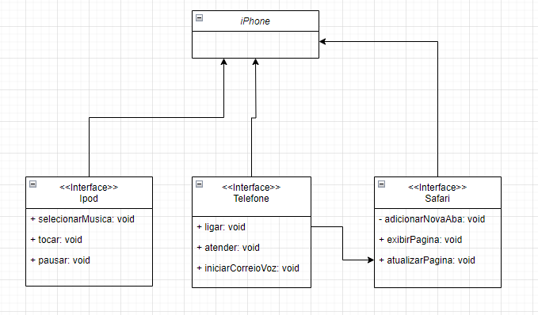

# desafio-poo-UML
### Desafio do bootcamp de Java focado em interfaces em POO.

*POO - Desafio - DIO.me*
#### Autor: Gleyson Sampaio
- Modelagem e diagramação da representação em UML e Código no que se refere ao componente iPhone.

Elabore em uma ferramenta de UML de sua preferência a diagramação das classes e interfaces com a proposta de representar os papéis do iPhone de: Reprodutor Musicial, Aparelho Telefônico e Navegador na Internet. Em seguida crie as classes e interfaces no formato de arquivos .java.

**Comportamentos esperados:**
Reprodutor Musicial: tocar, pausar, selecionarMusica.
Aparelho Telefônico: ligar, atender, iniciarCorreioVoz.
Navegador na Internet: exibirPagina, adicionarNovaAba, atualizarPagina.

## Diagrama feito com draw.io:

